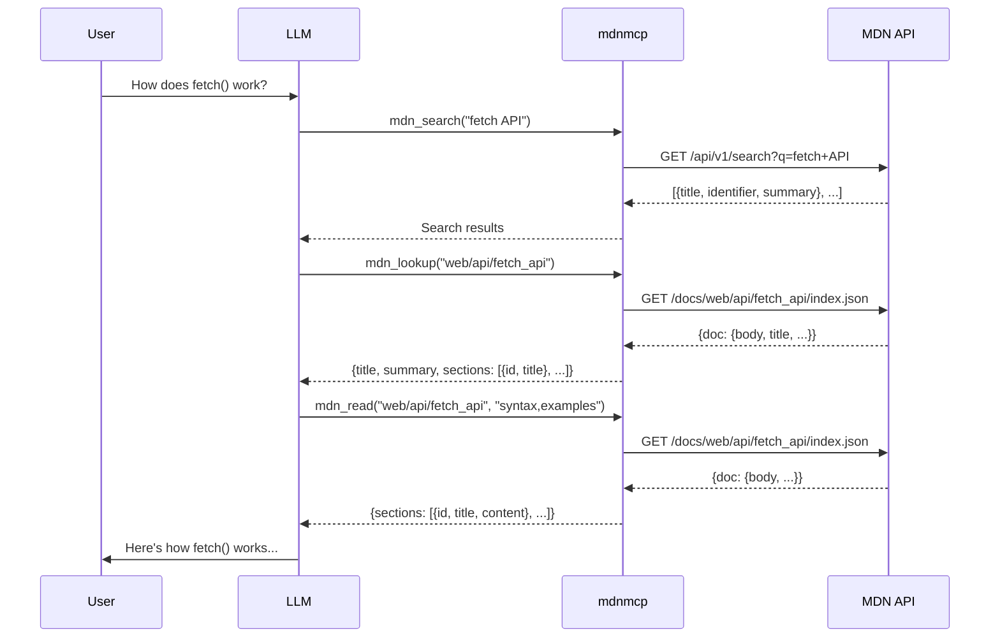

# mdnmcp

A lightweight MCP server that provides real-time access to [MDN Web Docs](https://developer.mozilla.org/) for LLMs and AI coding assistants.

## Why?

LLMs often hallucinate outdated or incorrect web API information. This MCP server gives them direct access to MDN's official documentation with a token-efficient, layered approach.

## Features

- **Real-time data:** Fetches directly from MDN's API, always up-to-date
- **Pinpoint content:** Search → List sections → Read specific content
- **Token efficient:** Only fetch what you need, not entire documents
- **Small model friendly:** Designed for local LLMs

## Tools

This MCP server provides three tools:

| Tool         | Description                     |
| ------------ | ------------------------------- |
| `mdn_search` | Search MDN documentation        |
| `mdn_lookup` | Get document sections list      |
| `mdn_read`   | Read specific section's content |

### Example Flow



## Installation

This is remote MCP server, add this to your MCP configuration:

```json
{
  "mdnmcp": {
    "url": "https://mdnmcp.fastmcp.app/mcp"
  }
}
```

## Development

### Install dev dependencies

```bash
uv sync --group dev
```

### Run tests

```bash
uv run pytest
```

## License

MIT
